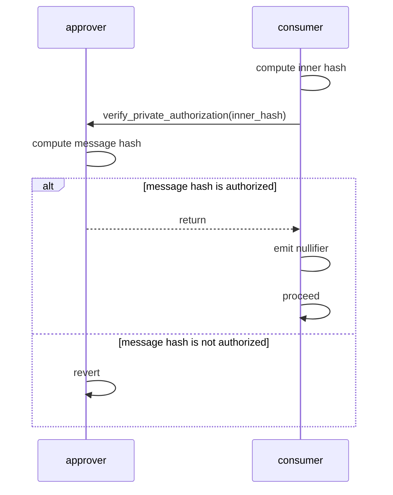
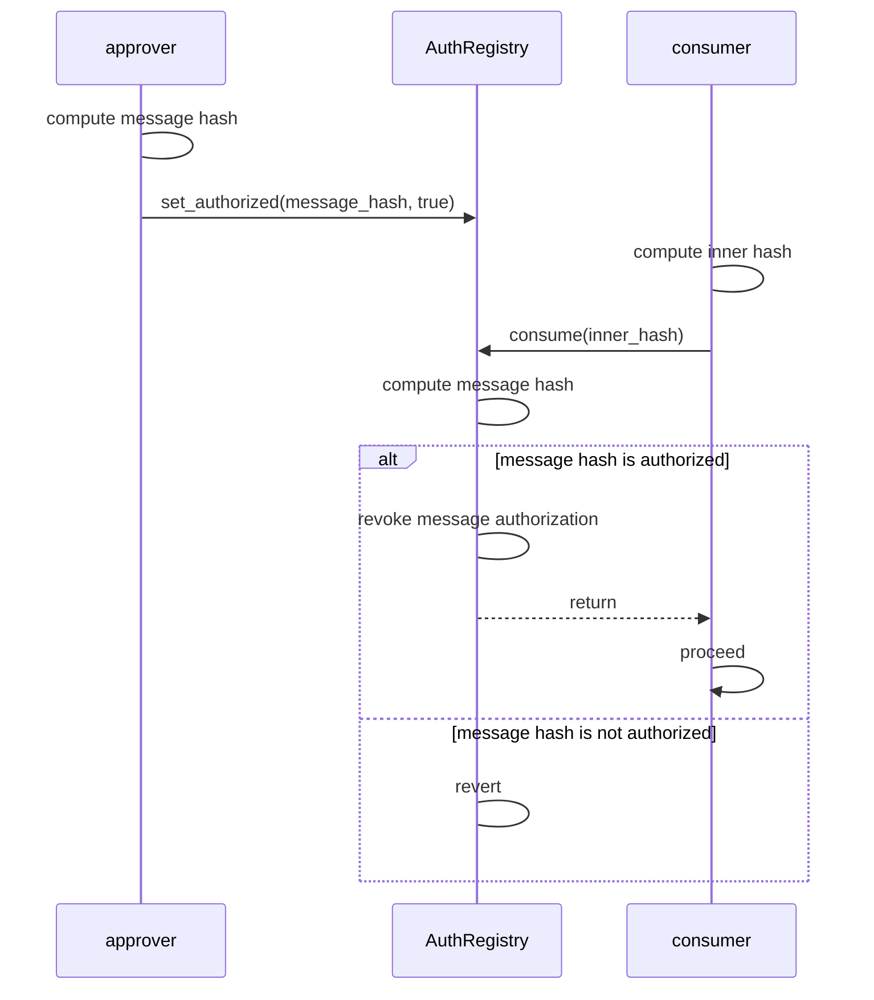

# Aztec Improvement Proposal: Authorization

## Preamble

| `azip` | `title` | `description` | `author` | `discussions-to` | `status` | `category` | `created` |
| --- | --- | --- | --- | --- | --- | --- | --- |
| 11 | Authorization | Authorization flow on behalf of an account | Jan Beneš (benesjan), Josh Crites (critesjosh), Michael Connor (iAmMichaelConnor), Nicolás Venturo (nventuro), Gregorio Juliana (Thunkar), Paperclip Minimizer (paperclip-minim) | https://github.com/AztecProtocol/governance/discussions/27 | Draft | Standard | 2026-05-07 |

## Abstract

Most decentralized protocols require conditioning the dispatch of an action on a contract's authorization. Account abstraction implies there's no self-evident interface for such authorizations.

This proposal formalizes the current de facto mechanism through which a contract can authorize a message. Furthermore, it formalizes the construction of messages currently used to represent function call authorizations.

The standard is not mutually exclusive with other means of authorization. These mechanisms, like binding many account contracts to a single other key, or to a ZKPassport-related check, could kick in if this mechanism fails.

## Impacted Stakeholders

Relevant to any application that requires access control: tokens, NFTs, ID-like, governance, etc.

## Motivation

DeFi protocols rely on conditioning actions on its authorization by an address. These actions regard asset handling (transfering, vesting, staking, etc), permission changes, or protocol behaviour changes.

Furthermore, composition oftentimes requires that a contract act *on behalf of* another contract. The most frequent such use is pulling tokens from a user as payment, as done by AMMs, during liquidations, intent settlement, bridging, and so forth.

Ethereum protocols use many means of delegated authorization, most prominently [ERC-20](https://github.com/ethereum/ERCs/blob/master/ERCS/erc-20.md) and [ERC-721](https://github.com/ethereum/ERCs/blob/master/ERCS/erc-721.md)'s `approve` then `transferFrom` flow, [ERC-2612’](https://github.com/ethereum/ERCs/blob/master/ERCS/erc-2612.md)s `permit`, and [ERC-3009](https://github.com/ethereum/ERCs/blob/master/ERCS/erc-3009.md)'s `transferWithAuthorization`. These authorization methods are tied to a specific action, defined at the contract level.

This standard stablishes a mechanism through which all compliant contracts can define authorization to arbitrary messages, with the advantage that the same asuthorization mechanism can be reused for any delegated authorization requirement. A definition of a standard “function call” authentication message further easens application composability between protocols and users, including the wallets themselves.

All uses of delegated authorization are unlocked without caveats in public, and in private with the caveat that handing useful authorizations to other parties requires disclosure of private information.

## Overview

Messages for which authorization is gonna be requested are first transformed into a constant-size domain-separated commitment, in two stages:

1. Hash the message to make it constant-size. This is the "inner hash".
2. Domain-separate the inner hash with a second hash, to make it unique per consumer and current rollup. This is the "message hash".

Domain separation must happen in a trusted part of the flow.

There are two authorization flows, one for authorization in private and another for authorization in public.

Private authorization is done as follows



Public authorization uses an authorization registry contract called AuthRegistry



Public authorization also allows the revoking of an authorization `set_authorized(message_hash, false)` as well as a “reject all” switch that makes all authorizations fail.

## Specification

The key words "MUST", "MUST NOT", "REQUIRED", "SHALL", "SHALL NOT", "SHOULD", "SHOULD NOT", "RECOMMENDED", "NOT RECOMMENDED", "MAY", and "OPTIONAL" in this document are to be interpreted as described in RFC 2119 and RFC 8174.

### Terminology

**Message**: an array of `Field`s

**Authorize**: a contract is said to *authorize* a message if it causes an *authorization* function (defined in [Private authorization](#private-authorization) and [Public authorization](#public-authorization)) to execute without reverting.

**Approver**: the contract whose authorization is required for the message.

**Consumer**: the contract that's conditioning its flow to the approver's authorization of a message.

**Inner hash**: commitment to a message's content, irrespective of the consumer or aztec version.

**Message hash**: commitment to a message, including the consumer, the rollup version, and the chain ID.

**Succeed**: a function is said to succeed if it doesn't revert.

### Constants

**`DOM_SEP__AUTH_INNER: u32 = poseidon2_hash_bytes("az_dom_sep__authwit_inner".as_bytes())`**: domain separator for computing the inner hash of a message

**`DOM_SEP__AUTH_MESSAGE: u32 = poseidon2_hash_bytes("az_dom_sep__authwit_outer".as_bytes())`**: domain separator for computing the message hash

**`DOM_SEP__AUTH_NULLIFIER: u32 = poseidon2_hash_bytes("az_dom_sep__authwit_outer".as_bytes())`**: domain separator for computing an authorization’s nullifier

**`CANONICAL_AUTH_REGISTRY_ADDRESS: Field = 0x1`**: deployment address of the canonical authorization registry

### Message authorization

### Inner hash

The message `args: [Field; N]` MUST be transformed into an *inner hash* via

```rust
fn compute_inner_authorization<let N: u32>(args: [Field; N]) -> Field {
    poseidon2_hash_with_separator(args, DOM_SEP__AUTH_INNER)
}
```

### Message hash

The message hash MUST be computed as

```rust
pub fn compute_authorization_message_hash(
    consumer: AztecAddress,
    chain_id: Field,
    version: Field,
    inner_hash: Field,
) -> Field {
    poseidon2_hash_with_separator(
        [consumer.to_field(), chain_id, version, inner_hash],
        DOM_SEP__AUTH_MESSAGE,
    )
}
```

where:

- `consumer` is the message's consumer
- `chain_id` is the Aztec rollup's chain ID
- `version` is the Aztec rollup's version
- `inner_hash` is the inner hash

Both `chain_id` and `version` are common to all messages within a specific rollup version, and MUST be the correct values.

Message authorization MUST NOT be done over the inner hash alone, only over the full message hash as defined just above.

### Private authorization

The approver MUST implement the following methods

```rust
#[external("private")]
#[view]
fn verify_private_authorization(self, inner_hash: Field);
```

Succeeds if and only if the message is authorized by the approver, with the caller as the consumer.

The consumer MUST treat the message as authorized by the approver if and only if an external call to `verify_private_authorization` succeeds, after which it MUST emit a nullifier deterministically computed from the inner hash and the approver's consumer-siloed nullifying public key, domain separated through `DOM_SEP__AUTH_NULLIFIER`.

For authorizations that are meant to happen repeatedly, the consumer MUST include a nonce field in the message with no semantic purpose.
The call MUST be static in order to prevent reentrancy.
The consumer MAY omit a call to `verify_private_authorization` if another authorization method is viable, at its discretion.

### Authorization registry

### Storage

The `AuthRegistry` MUST store, for every address:

- The set of authorized messages, via their message hash
- A "reject all" flag that makes all authorization calls revert, irrespective of the authorization status of each individual message.

### Methods

It MUST expose the following methods:

```rust
#[external("public")]
fn set_authorized(message_hash: Field, authorize: bool);
```

Set the authorization status of message with message hash `message_hash` to `authorize` for the caller.

```rust
#[external("private")]
fn set_authorized_private(approver: AztecAddress, message_hash: Field, authorize: bool);
```

Set the authorization status of message with message hash `message_hash` to `authorize` on behalf of `approver`.

MUST privately request that `approver` authorizes the function call as specified by [private authorization](#private-authorization) and [function call authorization](#function-call-authorization).

```rust
#[external("public")]
fn set_reject_all(reject: bool);
```

Set the reject all flag to `reject` for the caller.

```rust
#[external("public")]
fn consume(on_behalf_of: AztecAddress, inner_hash: Field);
```

Succeeds if and only if the message is authorized by the approver, with the caller as the consumer.
Revokes the authorization for the message when succeeding.

```rust
#[external("public")]
#[view]
fn is_reject_all(on_behalf_of: AztecAddress) -> bool;
```

Whether the reject all flag is set for address `on_behalf_of`.

```rust
#[external("public")]
#[view]
fn is_consumable(on_behalf_of: AztecAddress, message_hash: Field) -> bool;
```

Whether message with message hash `message_hash` has been authorized by `on_behalf_of`.

### Public authorization

As part of the rollup's deployment, the `AuthRegistry` contract MUST be deployed at address `CANONICAL_AUTH_REGISTRY_ADDRESS`, behaving as specified in the [Authorization registry](#authorization-registry) section.

The approver MUST signal public authorization for message with message hash `message_hash` by calling `set_authorized(message_hash, true)`.
The approver MAY mask all public authorizations as non-authorized by calling `set_reject_all(true)`, and re-enable them by calling `set_reject_all(false)`.

The consumer MUST treat message with inner hash `inner_hash` as authorized by `on_behalf_of` to itself if and only if an external call to `consume(on_behalf_of, inner_hash)` succeeds.
The consumer MAY check whether `!is_reject_all(on_behalf_of) && is_consumable(on_behalf_of, message_hash)` to know whether `consume` will succeed.

### Function call authorization

A private or public call SHOULD be considered authorized if either the caller is the approver itself, or a call authorization message as defined below is authorized by the approver.

The function call authorization message MUST be computed as the serialization of

```rust
struct CallAuthorization {
    msg_sender: AztecAddress,
    selector: FunctionSelector,
    args_hash: Field,
}
```

where:

- `msg_sender` is the consumer
- `selector` is the function selector, as returned by the `Context` inside the function to authorize
- `args_hash` is the hash of the arguments, as returned by the `Context` inside the function to authorize

*NOTE*: a function's selector or the arguments hash MAY be computed differently by the `PrivateContext` than the `PublicContext`.

## Rationale

The computation of the message hash is performed in two stages to separate the computation of "what" is being authorized and "who" is consuming it, in order for the domain separation to the rollup and consumer is performed by trusted code.

This standard is not mutually exclusive with other authorization schemes, in anticipation of possible future alternatives that protocols may want to implement. A protocol may want to e.g. use a specific signature scheme as an alternative means to authorize messages.

## Backwards Compatibility:

No backwards incompatibility is introduced by this AZIP.

## Reference Implementation:

Reference implementations for authorization can be found:

- For the [approver](https://github.com/AztecProtocol/aztec-packages/blob/v4.2.0/noir-projects/aztec-nr/aztec/src/authwit/account.nr)
- For the [consumer](https://github.com/AztecProtocol/aztec-packages/blob/v4.2.0/noir-projects/aztec-nr/aztec/src/authwit/auth.nr#L251-L262)
- For the [AuthRegistry](https://github.com/AztecProtocol/aztec-packages/blob/v4.2.0/noir-projects/noir-contracts/contracts/protocol/auth_registry_contract/src/main.nr)

## Security Considerations:

### Domain separation

Domain separation happens in trusted code, and is thus a non-issue.

### Replay protection

In public, replay protection is provided by the `AuthRegistry` via revoking the approval after checking the authorization.

In private, replay protection must be done by the consumer, as specified here. Contracts that don't use the standard Aztec helpers and don't implement replay protection themselves are vulnerable and non-compliant.

### Reentrancy

In public, the authorization check is performed by calling the trusted `AuthRegistry`, which will not attempt reentrancy.

In private, compliant consumers must ensure the call to `verify_private_authorization` is static. Contracts that don't use the standard Aztec helpers and don't perform the call statically are vulnerable and non-compliant.

### Nullifier privacy leakage

Replay protection relies on the emission of a nullifier computed from the inner hash.

The inclusion of the approver's consumer-siloed public nullifying key prevents brute-force attacks on authorizations that don't feature any kind of nonce. This could be the case e.g. if a function call is meant to be called only once per account.

### Approver side risk

Each account contract's `verify_private_authorization` is custom code. Bugs on this function compromise the approver. This standard delegates that safety surface entirely to account authors.

## Copyright Waiver:

Copyright and related rights waived via [CC0](/LICENSE).
