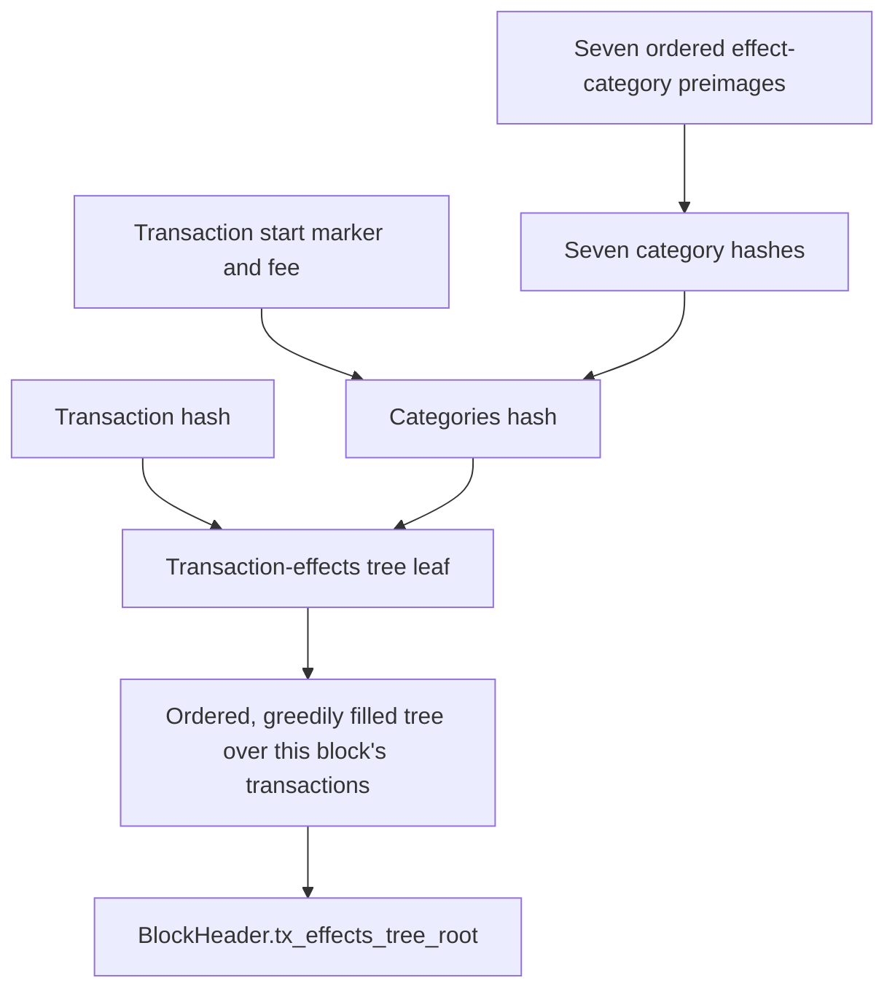

# AZIP-26: Transaction Effects Tree in Block Headers

## Preamble

| `azip` | `title` | `description` | `author` | `discussions-to` | `status` | `category` | `created` |
| --- | --- | --- | --- | --- | --- | --- | --- |
| 26 | Transaction Effects Tree in Block Headers | Adds a block-header commitment and membership witnesses binding each transaction hash to its effects. | Ilyas Ridhuan (@IlyasRidhuan), Santiago Palladino (@spalladino), Mike Connor (@iAmMichaelConnor) Leila Wang (@LeilaWang)  Álvaro Rodríguez (@sirasistant) | N/A | Approved | Core | 2026-09-08 |

## Abstract

This AZIP adds `tx_effects_tree_root` to each L2 block header. It introduces a unique tx effects tree _per block_, which commits to all tx effects of all txs in that block, in a neat structure designed for efficient membership proofs within a circuit. Applications can use it to efficiently prove that a transaction produced a particular tx effect, such as a note hash, instead of the existing inefficient approaches of replaying a checkpoint blob sponge or opening a bls12-381 kzg commitment. Hashing tx effects by category (note hashes, nullifiers, etc) lets apps prove a claim about one category without needing to process the others. Blob encoding and the existing sponge commitment are unchanged.

## Impacted Stakeholders

**App Developers.** Contracts can prove claims about transaction effects. Applications that read headers or reference affected canonical contracts need the updates described under Backwards Compatibility.

**Wallets and PXE Implementers.** Header serialization, historical-header oracles, and affected stored data must support the new layout.

**Infrastructure Providers.** Nodes and indexers reconstruct the root from published effects and can serve membership witnesses.

**Sequencers and Provers.** Transaction-base and merge circuits perform additional hashing and carry a new public-input field. Builders must compute the same root.

## Motivation

A contract may need to prove that transaction X emitted note hash Y. Today, proving this with `sponge_blob_hash` requires replaying part of the checkpoint's cumulative blob sponge, including data beyond X's effects. In some cases, this could require tens-of-thousands of poseidon2 operations, which is considered too slow for many applications, and certainly too slow if proving existence of a tx effect within a circuit.

With the proposed root, the contract needs only X's metadata, its note hashes, the other six category hashes, and a Merkle path to the block root. It need not process X's logs or other transactions' effects. Frameworks can expose proofs for a single tx effect, or all effects of some category (e.g. note hashes) of a tx, or all of a tx's effects.

## Specification

The key words "MUST", "MUST NOT", "REQUIRED", "SHALL", "SHALL NOT", "SHOULD", "SHOULD NOT", "RECOMMENDED", "NOT RECOMMENDED", "MAY", and "OPTIONAL" in this document are to be interpreted as described in RFC 2119 and RFC 8174.

### Commitment Structure

First, hash the fields of each of the seven tx effect categories individually (note hashes, nullifiers, l2-to-L1 messages, public data writes, private logs, public logs, contract class logs). Combine those hashes with the transaction metadata to form a leaf, then combine the leaves into the block's Merkle root.



### Hashing and Domain Separation

All new commitments use the protocol's existing Poseidon2 field hash. Define `H_d(xs)` as `poseidon2_hash_with_separator(xs, d)`: Poseidon2 hashes the field sequence `[d, ...xs]`, using its actual input length. A dynamic array contributes only its active prefix; unused capacity MUST NOT be absorbed.

The following domain separators MUST be used:

| Commitment | Constant | Decimal value |
| --- | --- | --- |
| One effect category | `DOM_SEP__TX_EFFECT_CATEGORY_HASH` | 1030022731 |
| All categories and scalar metadata | `DOM_SEP__TX_EFFECT_CATEGORIES_HASH` | 1426387399 |
| Transaction-effects tree leaf | `DOM_SEP__TX_EFFECTS_TREE_LEAF` | 1186802524 |
| Transaction-effects tree internal node | `DOM_SEP__TX_EFFECTS_TREE` | 2908237871 |

### Transaction-Effect Category Preimages

The commitment MUST use the final `TxEffect` constrained by the private or public transaction-base circuit, including the revert outcome and fee-related effects. Existing revert rules and effect-count limits apply.

There are seven category commitments, ordered as follows. Arrays and logs MUST retain their published order.

| Position | Category | Hash preimage |
| --- | --- | --- |
| 0 | Note hashes | Active note hashes. |
| 1 | Nullifiers | Active nullifiers. |
| 2 | L2-to-L1 messages | Active message hashes from the final effect, including the existing siloing. |
| 3 | Public-data writes | Concatenated `[leaf_slot, value]` pairs. |
| 4 | Private logs | For each active log, `[length, ...fields[0:length]]`, concatenated in log order. |
| 5 | Public logs | Concatenated `[length, contract_address, ...fields[0:length]]` entries from the active flat blob payload. |
| 6 | Contract-class logs | For the single permitted log, `[contract_address, contract_class_log_hash]`; an absent log has an empty preimage. |

For a preimage `P_i`, the category hash MUST be:

```text
C_i = 0                                        if P_i is empty
C_i = H_TX_EFFECT_CATEGORY_HASH(P_i)             otherwise
```

The first six preimages use the existing [blob encoding][blob-encoding] and [public-log encoding][public-logs], subject to the [protocol bounds][constants].

Contract-class logs are the exception: `contract_class_log_hash` MUST be computed by the existing protocol function `compute_contract_class_log_hash` (see its [implementation in `hash.nr`](https://github.com/AztecProtocol/aztec-packages/blob/ae2aaced77714b91130fe053b38e483a33dfe8a7/noir-projects/fnd/noir-protocol-circuits/crates/types/src/hash.nr#L156)). This function computes `poseidon2_hash(fields)` over the full `CONTRACT_CLASS_LOG_SIZE_IN_FIELDS`-element array, including its canonical padding.

Only the first `length` entries of that array, `fields[0:length]`, are published in the transaction's blob data; the remaining padding fields are omitted. The hash MUST still include that padding to match the existing log hash validated against the kernel output. It MUST NOT be replaced by a hash of only `fields[0:length]`. A consumer reconstructing the hash from blob data MUST restore the canonical padding before hashing.

The category also commits to `contract_address`, the address of the contract that emitted the log. The transaction start marker commits to `length`, the number of log payload fields published in the blob.

The transaction-base circuit MAY reuse the contract-class-log hash already validated against the kernel output. Any reused hash MUST correspond to the same log fields used to construct the transaction's blob data.

### Start Marker, Categories Hash, and Leaf

Let `M` be the transaction's existing blob start marker and `F` its transaction fee. `M` MUST be derived from the same effects and lengths as the category preimages. `M` retains the existing packing, from most significant to least significant bits:

| Component | Width in bits |
| --- | --- |
| `TX_START_PREFIX = 0x9c707518` | 32 |
| Number of note hashes | 16 |
| Number of nullifiers | 16 |
| Number of L2-to-L1 messages | 16 |
| Number of public-data writes | 16 |
| Number of private logs | 16 |
| Sum of active private-log payload lengths | 16 |
| Length of the flat public-log payload | 32 |
| Active contract-class-log payload length | 16 |
| Revert code | 8 |
| Total number of transaction blob fields | 32 |

The private-log payload-length sum excludes per-log length fields. The total blob-field count includes the three leading fields (`M`, transaction hash, and fee) and all active category blob fields, including per-log lengths. Count a contract-class log by its published address and active payload, not by the hash preimage used above. Existing bounds and canonical encoding rules apply.

The categories hash has exactly nine input fields before domain separation:

```text
categories_hash = H_TX_EFFECT_CATEGORIES_HASH([M, F, C_0, C_1, C_2, C_3, C_4, C_5, C_6])
leaf = H_TX_EFFECTS_TREE_LEAF([tx_hash, categories_hash])
```

The transaction hash is the existing hash carried by the final effect.

### Ordered Tree Construction

Each block MUST have one leaf for every included transaction, in block order. Included reverted transactions contribute their final effects. There are no padding transactions in this tree. Leaves or subtree roots MUST NOT be skipped because their field value is zero.

Define `N(left, right) = H_TX_EFFECTS_TREE([left, right])`. For an ordered leaf sequence `L` with length `n`, its root MUST be:

```text
R([]) = 0
R([leaf]) = leaf
R(L) = N(R(L[0:k]), R(L[k:n]))   for n > 1
```

Here `k` is the largest power of two strictly smaller than `n`. This fills the left subtree completely before the right, matching the existing greedy transaction rollup tree.

Examples:

| Transactions | Root |
| --- | --- |
| 3 | `N(N(L0, L1), L2)` |
| 5 | `N(N(N(L0, L1), N(L2, L3)), L4)` |
| 7 | `N(N(N(L0, L1), N(L2, L3)), N(N(L4, L5), L6))` |
| 8 | `N(N(N(L0, L1), N(L2, L3)), N(N(L4, L5), N(L6, L7)))` |

The tree is scoped to one block and restarts for each subsequent block in the checkpoint.

### Circuit Public Inputs and Block Header

`TxRollupPublicInputs` MUST gain one field named `accumulated_tx_effects_tree_root`, serialized immediately after `out_hash` and before `accumulated_fees`. Its TypeScript counterpart is `accumulatedTxEffectsTreeRoot`.

The private and public transaction-base circuits MUST output the transaction's leaf in this field. Each transaction-merge circuit MUST output `N(left_root, right_root)`, preserving the existing transaction-order and greedy-fill constraints. The block-root circuits MUST output the transaction's leaf for one transaction, the completed accumulated root for multiple transactions, or zero for no transactions.

`BlockHeader` MUST gain one field named `tx_effects_tree_root`, serialized immediately after `sponge_blob_hash` and before `global_variables`. Its TypeScript counterpart is `txEffectsTreeRoot`. Header hashing MUST include the new field in this position. Both affected public structure lengths increase by one field, including when the new value is zero.

Block builders, provers, and archivers reconstructing headers from published blob data MUST derive an identical root from the block's effects. The new commitment MUST remain consistent with the effects absorbed into the existing blob sponge.

### Membership Verification

A membership witness contains `leafIndex` and `siblingPath`. The path lists sibling hashes from the leaf towards the root. At step `j`, bit `j` of `leafIndex` gives the current node's side: zero for left, one for right. Because leaves can sit at different depths, `leafIndex` is the leaf's position at its depth and can differ from its transaction index.

To verify a witness, a consumer MUST:

1. Authenticate the claimed block's header and read its `tx_effects_tree_root`.
2. Recompute the leaf from the claimed transaction hash and effects, or verify a proof that binds the leaf to those inputs using the specified hash domains.
3. Starting with the leaf, hash with each sibling on the indicated side and check that the result equals the header's root.

A single-transaction witness has `leafIndex = 0` and an empty sibling path.

Alternative implementations MAY expose different witness APIs while preserving these verification rules.

## Rationale

**Block scope and tree shape.** A root per block supports inclusion proofs while preserving the checkpoint's data-availability commitment. The existing greedy rollup tree avoids padding and needs at most `ceil(log2(n))` siblings for a block of `n > 0` transactions.

**Category hashes.** Hashing each category separately lets a proof process only the category it needs, using hashes for the rest. Individual effects are not Merkle leaves: proving that a note hash was emitted still requires proving it belongs to the committed note-hash list.

**Separate categories hash and leaf.** The categories hash commits to the effects and metadata independently of the transaction hash. The two-field leaf then binds that commitment to a transaction. This costs one extra hash per transaction: hashing everything directly into the leaf would also support category proofs. The extra layer provides a separate effects commitment; it is not required for category proofs.

**Contract-class-log hash reuse.** Reusing the padded log hash already validated by the base circuit avoids a large hash computation. This is why the category uses that hash instead of the published log fields.

## Alternatives Considered

**Opening the blob sponge.** Reusing `sponge_blob_hash` avoids a new commitment, but proving a transaction effect requires replaying the sequential sponge over additional checkpoint data, including unrelated effects. The resulting data processing and Poseidon2 work are costly even outside a circuit; constraining that replay inside a circuit also increases proving cost. A Merkle path bounds the work needed to authenticate the transaction's effects without replaying the checkpoint data.

**Opening a BLS12-381 KZG commitment.** Batched transaction-range openings are viable outside circuits and reduce bandwidth; full ranges support completeness claims that isolated field openings cannot. Proof generation adds work but is delegable and cacheable. The main integration obstacle is authentication: `blobsHash` is anchored in a checkpoint header that L2 block headers do not reference. Consumers relying on L2 block headers therefore need additional checkpoint authentication, potentially including L1 portal changes and checkpoint-header pinning. BLS12-381 pairing verification also remains expensive inside Aztec's BN254 circuits. This proposal instead commits transaction effects directly in each L2 block header, supporting efficient verification in both settings.

## Backwards Compatibility

This is a breaking change and MUST activate with a new rollup version. Sequencers, provers, and nodes MUST adopt the header and public-input layouts together, with matching circuit artifacts and verification keys. Old and new public-input layouts MUST NOT be mixed in a proof chain.

Historical-header oracles MUST return the new field for the new version. Affected contracts MUST be recompiled. Changed classes can produce different deployment addresses, so applications MUST update affected canonical-contract references. Address derivation and reserved protocol addresses are unchanged. Transaction hashes may change across versions if they depend on changed header or circuit inputs.

The genesis header MUST include a zero effects root. Genesis header and archive commitments MUST be regenerated from the activating release's complete configuration, consistently across Noir, TypeScript, and C++. Its [AZUP](../azup-process.md) MUST identify the rollup version, verification keys, affected contracts, and canonical deployments. Client-specific database migrations and oracle versions belong to the release documentation.

Recomputing a root for an old block does not authenticate it. These witnesses apply only to versions whose headers include the root. Multi-version tooling MUST retain the original layouts and commitments for earlier blocks.

## Test Cases

Implementations MUST match the cross-language vectors in aztec-packages: the [transaction-effect tests][tx-effect-tests] cover empty, small, and maximum-size effects and a three-transaction tree root; the [block-header test][block-header-test] covers the all-zero header hash. These fixtures test hashing, not transaction validity; the all-zero header is distinct from the initialized genesis header.

Protocol conformance tests MUST cover:

1. Tree shapes for zero through seven transactions, including subtree roots whose value is zero and independent roots for adjacent blocks in a checkpoint.
2. Agreement between independent leaf computation and private/public base circuits, including reverted effects, fee-related writes, and maximum-size legal effects.
3. Commitment sensitivity to category order, active lengths, transaction hash, fee, revert code, and log addresses and payloads.
4. Unchanged blob encoding and sponge results for identical effect inputs.
5. Cross-language header and public-input serialization and hashing, including genesis commitments.
6. Membership verification against authenticated headers, leaf-preimage validation, rejection of inconsistent data, and revalidation against a replacement block's header after a reorg.

## Reference Implementation

[aztec-packages PR #25381](https://github.com/AztecProtocol/aztec-packages/pull/25381), pinned at [ae2aaced](https://github.com/AztecProtocol/aztec-packages/commit/ae2aaced77714b91130fe053b38e483a33dfe8a7), implements the [commitments][tx-effect] and [header layout][block-header]. Its [client patches](https://github.com/AztecProtocol/aztec-packages/tree/ae2aaced77714b91130fe053b38e483a33dfe8a7/labs-patches) contain API/storage regression tests and build-specific migration details.

The reference node exposes:

```text
getTxEffectMembershipWitness(txHash: TxHash)
    -> { blockNumber: BlockNumber, root: Fr,
         leafIndex: bigint, siblingPath: SiblingPath<number> } | undefined
```

It returns `undefined` for an unknown transaction or unavailable block, and errors on inconsistent stored effects, leaves, or roots. Storage, caching, and database versioning are implementation choices.

## Security Considerations

**Authentication and finality.** Consumers MUST authenticate the header through existing chain/proof mechanisms and apply their required finality policy. A node's response alone is insufficient, and a witness for a discarded block proposal does not prove canonical inclusion. Effects record past execution; applications must still check current state and authorization.

**Commitment binding.** Domain separation distinguishes category hashes, the categories hash, leaves, and internal nodes. A Merkle path alone does not prove a claim about effects. Verification must bind the leaf to its inputs, as specified above: the transaction hash, start marker, fee, and ordered category commitments. Proofs about selected categories must also establish each claimed property.

**Execution and data consistency.** The root MUST commit to the same final effects as execution and the blob sponge. Circuits MUST constrain every active field and length in hinted encodings. Reused contract-class-log hashes MUST be validated against the same published log. Witness services must read consistent chain state and invalidate data removed by a reorg. Consumers still need effect data or a proof of the requested property; the commitment does not guarantee data availability or retention.

**Costs.** Each leaf adds one hash per nonempty category plus the categories and leaf hashes. A block of `n > 0` transactions adds `n - 1` internal hashes. The reference archiver stores leaves and rebuilds internal nodes for each request.

## Copyright Waiver

Copyright and related rights waived via [CC0](/LICENSE).

[blob-encoding]: https://github.com/AztecProtocol/aztec-packages/blob/ae2aaced77714b91130fe053b38e483a33dfe8a7/noir-projects/fnd/noir-protocol-circuits/crates/types/src/blob_data/tx_blob_data.nr
[public-logs]: https://github.com/AztecProtocol/aztec-packages/blob/ae2aaced77714b91130fe053b38e483a33dfe8a7/noir-projects/fnd/noir-protocol-circuits/crates/types/src/abis/public_logs.nr
[constants]: https://github.com/AztecProtocol/aztec-packages/blob/ae2aaced77714b91130fe053b38e483a33dfe8a7/noir-projects/fnd/noir-protocol-circuits/crates/types/src/constants.nr
[tx-effect]: https://github.com/AztecProtocol/aztec-packages/blob/ae2aaced77714b91130fe053b38e483a33dfe8a7/noir-projects/fnd/noir-protocol-circuits/crates/types/src/blob_data/tx_effect.nr
[block-header]: https://github.com/AztecProtocol/aztec-packages/blob/ae2aaced77714b91130fe053b38e483a33dfe8a7/noir-projects/fnd/noir-protocol-circuits/crates/types/src/abis/block_header.nr

[tx-effect-tests]: https://github.com/AztecProtocol/aztec-packages/blob/ae2aaced77714b91130fe053b38e483a33dfe8a7/noir-projects/fnd/noir-protocol-circuits/crates/types/src/blob_data/tx_effect.nr#L363
[block-header-test]: https://github.com/AztecProtocol/aztec-packages/blob/ae2aaced77714b91130fe053b38e483a33dfe8a7/noir-projects/fnd/noir-protocol-circuits/crates/types/src/abis/block_header.nr#L106
