# Aztec Improvement Proposal: Pipelining Block Building

## Preamble

| `azip` | `title`                   | `description`                                                                                               | `author`                                                  | `discussions-to`                                          | `status` | `category` | `created`  |
| ------ | ------------------------- | ----------------------------------------------------------------------------------------------------------- | --------------------------------------------------------- | --------------------------------------------------------- | -------- | ---------- | ---------- |
| 6      | Pipelining Block Building | Increase block building time by having each proposer build during the slot preceding their checkpoint slot. | Santiago Palladino (@spalladino, santiago@aztec-labs.com) | https://github.com/AztecProtocol/governance/discussions/8 | Draft    | Core       | 2026-04-21 |

## Abstract

We can increase the time that proposers spend actually building new blocks, as opposed to waiting to checkpoint those blocks to L1, by building during the _previous_ slot they have assigned for checkpointing. This reduces the "dead zones" during which no new L2 blocks are being produced while the network waits on L1 to mine the next checkpoint, lowering transaction latency and increasing total throughput without modifying the rollup contract.

## Impacted Stakeholders

**Sequencers.** This proposal directly changes sequencer (proposer) behaviour. Each proposer MUST now build blocks during the slot preceding the one in which they checkpoint to L1, and MUST base their work on the previous proposer's checkpoint proposal rather than on the last checkpoint mined on L1. This change also increases the time available for each proposer to publish their checkpoint to L1, which should lead to fewer lost checkpoints due to L1 congestion, potentially reducing L1 gas costs for proposers.

**App Developers and Wallets.** Users benefit from lower end-to-end transaction latency (transactions submitted during what was previously a "dead zone" can now be included in the currently-building block) and higher total transactions-per-second.

## Motivation

The Aztec network partitions time in 72s slots. During each slot, a single **proposer** is chosen to build blocks and checkpoint them to L1. Every checkpoint must be **attested to** by a committee, who is expected to validate each block in the slot as it is produced.

This results in every proposer spending some time during its slot in building and streaming blocks to the rest of the network via p2p, and some time before the end of the slot, requesting and collecting attestations, and publishing the result to L1. Note that the L1 checkpoint tx **must** land during its slot, otherwise it's rejected by the rollup contract, so proposers need to allocate some time during their slot just for getting their L1 tx mined.

This leads to what we call "dead zones" where there is no perceived network activity. No new blocks are being produced, since the network is just waiting on L1 to mine the next checkpoint, which acts as a syncpoint. This increases latency for any Aztec transaction sent during the dead zone, which has to wait until the next slot to be mined, and lowers total transaction throughput (measured as transactions-per-second, TPS), by having less total time available for actual block building.

In the example below, the network is not building any new blocks for more than half the time, from 30s to 72s in the first slot. At 6s block times, this is just 5 blocks per slot.

```mermaid
  gantt
      title Without Pipelining (5 blocks/slot, 72s slots, 6s blocks)
      dateFormat HH:mm:ss
      axisFormat %M:%S
      tickInterval 12second

      section Slots
      Slot N+1                        :s1, 00:00:00, 72s
      Slot N+2                        :s2, 00:01:12, 72s

      section Proposer for slot N+1
      Building blocks 1-5             :active, p1build, 00:00:00, 30s
      Collecting attestations         :p1att, 00:00:30, 6s
      Publishing to L1                :crit, p1pub, 00:00:36, 24s

      section Proposer for slot N+2
      Building blocks 1-5             :active, p2build, 00:01:12, 30s
      Collecting attestations         :p2att, 00:01:42, 6s
      Publishing to L1                :crit, p2pub, 00:01:48, 24s

      section Validators
      Re-executing N+1 blocks 1-5     :v1, 00:00:06, 30s
      Re-executing N+2 blocks 1-5     :v2, 00:01:18, 30s
```

| Time   | Slot | Proposer for slot N+1      | Proposer for slot N+2      | Validators              |
| ------ | ---- | -------------------------- | -------------------------- | ----------------------- |
| T+0s   | N+1  | Building block 1           | Idle                       | Idle                    |
| T+6s   | N+1  | Building block 2           | Idle                       | Re-executing block 1    |
| T+12s  | N+1  | Building block 3           | Idle                       | Re-executing block 2    |
| T+18s  | N+1  | Building block 4           | Idle                       | Re-executing block 3    |
| T+24s  | N+1  | Building block 5 (last)    | Idle                       | Re-executing block 4    |
| T+30s  | N+1  | Collecting attestations    | Idle                       | Re-executing block 5    |
| T+36s  | N+1  | Publishing to L1           | Idle                       | Done, attestations sent |
| T+60s  | N+1  | Checkpoint N+1 lands on L1 | Idle                       | Idle                    |
| T+72s  | N+2  | Idle                       | Building block 1           | Idle                    |
| T+78s  | N+2  | Idle                       | Building block 2           | Re-executing block 1    |
| T+84s  | N+2  | Idle                       | Building block 3           | Re-executing block 2    |
| T+90s  | N+2  | Idle                       | Building block 4           | Re-executing block 3    |
| T+96s  | N+2  | Idle                       | Building block 5 (last)    | Re-executing block 4    |
| T+102s | N+2  | Idle                       | Collecting attestations    | Re-executing block 5    |
| T+108s | N+2  | Idle                       | Publishing to L1           | Done, attestations sent |
| T+132s | N+2  | Idle                       | Checkpoint N+2 lands on L1 | Idle                    |

_Note that the example above is just meant to be illustrative. The actual timetable is more complex, and accounts for additional initialization times, p2p roundtrips, fixed-cost operations, etc._

## Specification

The key words "MUST", "MUST NOT", "REQUIRED", "SHALL", "SHALL NOT", "SHOULD", "SHOULD NOT", "RECOMMENDED", "NOT RECOMMENDED", "MAY", and "OPTIONAL" in this document are to be interpreted as described in RFC 2119 and RFC 8174.

### Pipelined block building

To avoid modifications to the rollup contract logic, each proposer MUST build its blocks during the _previous_ slot they have assigned, and then use their own slot for collecting attestations and publishing the checkpoint to L1.

Concretely, the proposer assigned to slot `N+1`:

1. MUST build and stream its blocks during slot `N`.
2. MUST begin building as soon as it has received _and validated_ the checkpoint proposal for slot `N` from the previous proposer. Validation involves re-executing the last block in that proposal. Attestations for slot `N` are NOT required to begin building — requiring them would unnecessarily delay the start of block production.
3. MUST begin collecting attestations on its own checkpoint proposal toward the end of slot `N`, so that it has enough attestations ready by the time slot `N+1` starts.
4. MUST publish its checkpoint transaction to L1 such that the tx lands within slot `N+1`. The L1 rollup contract will reject any checkpoint tx that lands outside its slot. Implementations MAY begin attestation collection slightly earlier than the end of slot `N` in order to broadcast the L1 tx up to one L1 block (~12s) before slot `N+1` begins, so that the tx lands on the first L1 block of slot `N+1`.

Since blocks are broadcast to the p2p network as soon as they are built, the proposer for slot `N+1` will in the typical case have already received all but the last block of slot `N` by the time it receives the checkpoint proposal for slot `N`. The resulting start-up delay before the new proposer can begin building is therefore bounded by the time required to re-execute that single last block (approximately one block time).

### Proposal acceptance windows

Nodes MUST enforce strict time windows during which they accept block and checkpoint proposals:

- **Block proposals for slot `N+1`** MUST be processed only during slot `N`. Block proposals received for slot `N+1` outside of slot `N` MUST be rejected.
- **Checkpoint proposals for slot `N+1`** MUST be accepted only during slot `N` plus an additional `CHECKPOINT_PROPOSAL_GRACE_PERIOD` seconds. Checkpoint proposals received after this window MUST be rejected.

`CHECKPOINT_PROPOSAL_GRACE_PERIOD` is a protocol constant; its value is defined in the Parameters subsection below.

Validators MUST refuse to attest to checkpoint proposals received outside the window defined above. Validators MUST attest to at most one checkpoint proposal per slot.

### Handling of unmined checkpoints

Attestations and proposals are NOT gated by the previous checkpoint being mined on L1. A proposer MAY broadcast its checkpoint proposal and collect attestations even if the preceding slot's checkpoint has not yet been mined.

However, before submitting its own checkpoint transaction to L1, a proposer SHOULD verify that the previous checkpoint has been mined, so as to avoid sending an L1 transaction that would revert and waste gas.

If an L2 slot passes and the corresponding checkpoint is not mined on L1, then all nodes MUST automatically discard that checkpoint, along with any L2 blocks or checkpoints built on top of it, when syncing from L1. This check is performed by every node as it follows L1.

### Cross-epoch re-execution

The proposer for the first slot of a new epoch MUST be prepared to re-execute the last block of the final slot of the previous epoch in order to validate the incoming checkpoint proposal. As with intra-epoch transitions, all other blocks from the previous slot will have already been received via p2p by the time building starts, so the re-execution delay is bounded by a single block.

### Parameters

The following protocol parameters are introduced by this AZIP. Values are to be filled in prior to merging.

| Parameter                          | Value | Rationale                                                                                                                                                                                                                                                                     |
| ---------------------------------- | ----- | ----------------------------------------------------------------------------------------------------------------------------------------------------------------------------------------------------------------------------------------------------------------------------- |
| `CHECKPOINT_PROPOSAL_GRACE_PERIOD` | 8     | Number of seconds past the end of slot `N` during which nodes continue to accept a checkpoint proposal for slot `N+1`. Must account for realistic p2p propagation delays, while being short enough to prevent late proposals from invalidating the work of the next proposer. |

## Rationale

### Why pipelining

Pipelining reduces the dead zone to just the time required for validators to re-execute the last block in each slot, which at a 6s block time is just 6s every 72s slot. This allows fitting 11 blocks per slot instead of 5 under the current scheme. It also gives each proposer more time to get its checkpoint tx mined on L1, which should reduce the rate of lost checkpoints due to L1 congestion or poor gas-price choice, potentially reducing L1 gas costs for proposers.

The effect is illustrated below.

```mermaid
  gantt
      title With Pipelining (11 blocks/slot, 72s slots, 6s blocks)
      dateFormat HH:mm:ss
      axisFormat %M:%S
      tickInterval 12second

      section Slots
      Slot N                          :s0, 00:00:00, 72s
      Slot N+1                        :s1, 00:01:12, 72s
      Slot N+2                        :s2, 00:02:24, 72s

      section Proposer for slot N+1
      Building blocks 1-11            :active, p1build, 00:00:00, 66s
      Collecting attestations         :p1att, 00:01:06, 6s
      Publishing to L1                :crit, p1pub, 00:01:12, 24s

      section Proposer for slot N+2
      Building blocks 1-11            :active, p2build, 00:01:12, 66s
      Collecting attestations         :p2att, 00:02:18, 6s
      Publishing to L1                :crit, p2pub, 00:02:24, 24s

      section Validators
      Re-executing N+1 blocks 1-11    :v1, 00:00:06, 66s
      Re-executing N+2 blocks 1-11    :v2, 00:01:18, 66s
```

| Time   | Slot | Proposer for slot N+1           | Proposer for slot N+2           | Validators                       |
| ------ | ---- | ------------------------------- | ------------------------------- | -------------------------------- |
| T+0s   | N    | Building block 1                | Idle                            | Idle                             |
| T+6s   | N    | Building block 2                | Idle                            | Re-executing block 1             |
| T+12s  | N    | Building block 3                | Idle                            | Re-executing block 2             |
| T+18s  | N    | Building block 4                | Idle                            | Re-executing block 3             |
| T+24s  | N    | Building block 5                | Idle                            | Re-executing block 4             |
| T+30s  | N    | Building block 6                | Idle                            | Re-executing block 5             |
| T+36s  | N    | Building block 7                | Idle                            | Re-executing block 6             |
| T+42s  | N    | Building block 8                | Idle                            | Re-executing block 7             |
| T+48s  | N    | Building block 9                | Idle                            | Re-executing block 8             |
| T+54s  | N    | Building block 10               | Idle                            | Re-executing block 9             |
| T+60s  | N    | Building block 11 (last)        | Idle                            | Re-executing block 10            |
| T+66s  | N    | Collecting attestations         | Idle                            | Re-executing block 11            |
| T+72s  | N+1  | Publishing checkpoint N+1 to L1 | Building block 1                | Done block 11, attestations sent |
| T+78s  | N+1  | Publishing checkpoint N+1 to L1 | Building block 2                | Re-executing block 1             |
| T+84s  | N+1  | Publishing checkpoint N+1 to L1 | Building block 3                | Re-executing block 2             |
| T+90s  | N+1  | Publishing checkpoint N+1 to L1 | Building block 4                | Re-executing block 3             |
| T+96s  | N+1  | Checkpoint N+1 lands on L1      | Building block 5                | Re-executing block 4             |
| T+102s | N+1  | Idle                            | Building block 6                | Re-executing block 5             |
| T+108s | N+1  | Idle                            | Building block 7                | Re-executing block 6             |
| T+114s | N+1  | Idle                            | Building block 8                | Re-executing block 7             |
| T+120s | N+1  | Idle                            | Building block 9                | Re-executing block 8             |
| T+126s | N+1  | Idle                            | Building block 10               | Re-executing block 9             |
| T+132s | N+1  | Idle                            | Building block 11 (last)        | Re-executing block 10            |
| T+138s | N+1  | Idle                            | Collecting attestations         | Re-executing block 11            |
| T+144s | N+2  | Idle                            | Publishing checkpoint N+2 to L1 | Done block 11, attestations sent |
| T+168s | N+2  | Idle                            | Checkpoint N+2 lands on L1      | Idle                             |

### Why not change the rollup contract

An alternative design would relax the "checkpoint must land in its slot" rule at the L1 rollup contract, giving proposers more flexibility on L1. This AZIP deliberately avoids any rollup contract change for simplicity's sake.

### Syncpoint shift

This change means that L1 no longer is the syncing point between one proposer and the next one. In the current scheme, every proposer knows exactly what the last block of the chain is as their slot starts, just by looking at the rollup contract on L1. However, under pipelining, they need to build from the data broadcast by the previous proposer, though not yet mined.

The chosen start-building condition — receive and validate (re-execute) the previous proposal, without waiting for its attestations — minimises the delay between proposers. A potential future optimisation is to allow the proposer for slot `N+2` to begin building immediately upon receiving the slot `N+1` proposal, before validating it, and to withhold its first block until validation succeeds. This would further shrink the gap but at the cost of pushing unverified data into the proposer's archiver and running re-execution and block building in parallel; it is not included in this AZIP and is left as a possible optimisation.

### Fallback when a proposal is missed

If the proposer for slot `N+2` does not receive the checkpoint proposal for slot `N+1` in time, it builds from the latest available checkpoint for slot `N`. By the time slot `N+2` begins, the checkpoint for slot `N` must already have been mined on L1 (since it must land before slot `N+1` starts), so the fallback starting point is well-defined and retrievable from L1.

## Backwards Compatibility

This proposal is a protocol change in how the L2 network processes block and checkpoint proposals. All nodes on the network MUST upgrade in lockstep; nodes still running the pre-pipelining scheme would treat proposals for the "wrong" slot (block proposals for slot `N+1` arriving during slot `N`) as invalid and reject them, and would fail to produce timely checkpoints themselves since they would wait for the previous L1 checkpoint before starting to build.

No change to the L1 rollup contract is required. The rollup contract continues to accept checkpoint transactions only within their assigned L2 slot, exactly as today. Backwards compatibility therefore concerns only node software and the off-chain protocol.

## Security Considerations

### Forks from late or missing proposals

Because L1 is no longer the syncing point between proposers, the proposer for slot `N+2` may, if it does not receive the checkpoint proposal for slot `N+1` in time, choose to skip it due to perceived inactivity and build from slot `N` instead, potentially creating a fork.

This is mitigated by the strict proposal acceptance windows defined in the Specification. Block proposals for slot `N+1` are processed only during slot `N`, and checkpoint proposals for slot `N+1` are accepted only during slot `N` plus `CHECKPOINT_PROPOSAL_GRACE_PERIOD` seconds. Proposals received out of time are rejected by nodes, in particular validators, who will refuse to attest to checkpoints received too late. Since validators only attest to one proposal per slot, if two forks arise from conflicting proposals, only one of them can collect enough attestations to be published.

### Griefing by withholding a checkpoint

If the checkpoint for slot `N` fails to be mined on L1 due to congestion or a poor choice of gas price by the proposer, the work for slot `N+1` becomes invalid and must be discarded. A malicious proposer for slot `N` can exploit this by deliberately withholding its L1 checkpoint transaction at the last minute, griefing the proposer for slot `N+1` at the cost of forfeiting its own fees. This is mitigated by a new slashing conditions proposed in AZIP-7.

### Risk of building on a stale head

A proposer for slot `N+2` that failed to receive the checkpoint proposal for slot `N+1` in time may build from slot `N` even though the slot `N+1` proposal was in fact attested to and published to L1. In this case, the proposer for slot `N+2` checks the latest state from L1 before sending its own L1 checkpoint tx, but not before broadcasting its checkpoint proposal via p2p. This case must be handled carefully by any slashing logic to avoid penalising honest proposers that were victims of network conditions rather than acting maliciously.

## Copyright Waiver

Copyright and related rights waived via [CC0](/LICENSE).
