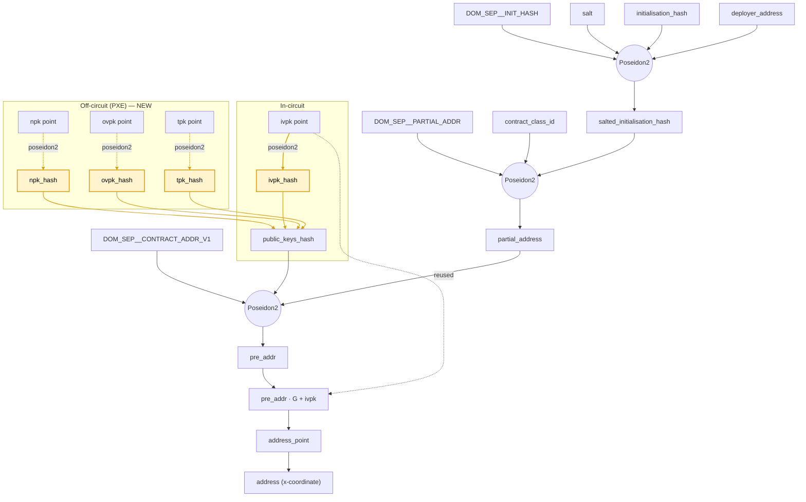

# AZIP-8: Public Key hash to mitigate Harvest-Now-X-Later risks

## Preamble

| `azip` | `title` | `description` | `author` | `discussions-to` | `status` | `category` | `created` |
|-----|-|-|-|-|-|-|-|
| 8 | Public Key hash to mitigate Harvest-Now-X-Later risks | Contract instances contain public key hash instead of public key points | Ilyas Ridhuan (@IlyasRidhuan), Mike Connor (@iAmMichaelConnor) | - | Draft | Core | 2026-04-27 |


## Abstract

Public keys in Aztec are points on the Grumpkin curve; these public keys are included as part of contract instances that are shared amongst participants. To mitigate the risk of Harvest-Now-Decrypt/Link-Later attacks, this AZIP proposes the migration to storing the public key hash of each
public key in the contract instance rather than the points themselves.

Note this does NOT apply to the Incoming Viewing Public Key (ivpk) which needs to remain as a point to satisfy the current encrypt-to-address scheme.

## Impacted Stakeholders

### App Developers
Noir contract authors who consume `get_public_keys(account)` see a struct reshape from `Point` to `Field` (a pre-computed hash), and the field-name convention changes from `masterNullifierPublicKey.hash()` to `npk_hash`. Existing contracts that consumed `npk_m`, `ovpk_m`, or `spk_m` as curve points will not compile and must be redesigned.
Apps MUST NOT see `npk_m` or `ovpk_m`; the Key Validation Request oracle and aztec-nr APIs enforce this at the interface level.

### Infrastructure Providers (Indexers, P2P Nodes, Block Explorers)
Off-chain decoders of the `ContractInstancePublished` event must update to the new payload shape (15 → 12 fields).

### Wallets
The `PublicKeys` struct changes from four `Point` fields to one `Point` (`IncomingViewingPublicKey`) plus three `Fr` hashes.

## Motivation

A contract instance in Aztec contains the set of public keys used for sensitive operations such as encrypting, signing, and nullifying. These keys are currently stored in the instance as elliptic points on the Grumpkin curve.
These instances need to be shared amongst participants in order for all parties to be able to validate the correctness of the instance they are interacting with (via address derivation).

A nefarious party may choose to collect (harvest) all on-chain information in the hopes that, if a quantum computer becomes available, they will be able to break the discrete log security of these points. By recovering the secret keys of these points,
they would be able to decrypt, link, and spend a user's notes, resulting in a total loss of funds and privacy.

## Specification

> The key words "MUST", "MUST NOT", "REQUIRED", "SHALL", "SHALL NOT", "SHOULD", "SHOULD NOT", "RECOMMENDED", "NOT RECOMMENDED", "MAY", and "OPTIONAL" in this document are to be interpreted as described in RFC 2119 and RFC 8174

### Overview of Different Keys

| `key name` | `key-pair (secret / public)` |  `Description` |
|------------|------------------------------|----------------|
| Nullifier Hiding Key | nhk / nhpk | Used to create nullifiers (e.g. when spending notes) |
| Incoming Viewing Key | ivsk / ivpk | Used to decrypt incoming ciphertexts. Used in encrypt-to-address |
| Outgoing Viewing Key | ovsk / ovpk | Used to encrypt outgoing logs. Used for record-keeping |
| Tagging Key | tsk / tpk | Used for tagging and note discovery |


### Change to Hashing Scheme for a Public Key
The protocol MUST compute the `public_key_hash` using a domain-separated Poseidon2 hash over the serialised point.

```noir
// Updated scheme
// where DOM_SEP__PUBLIC_KEY_HASH = poseidon2_hash_bytes(b"az_dom_sep__public_key_hash")
public_key_hash = Poseidon2::hash([DOM_SEP__PUBLIC_KEY_HASH, point.x, point.y])
```

### Changes to Contract Instances and Event Payload

The protocol-circuits `PublicKeys` struct SHALL be:

```noir
pub struct PublicKeys {
    pub npk_hash:  Field,
    pub ivpk:      IvpkM,
    pub ovpk_hash: Field,
    pub tpk_hash:  Field,
}
```


The event payload MUST change from 15 fields to 12 fields:

```noir
[ MAGIC, address, version, salt, class_id, init_hash,
  npk_hash,               //  2 fields → 1 field
  ivpk.x, ivpk.y,         //  unchanged
  ovpk_hash,              //  2 fields → 1 field
  tpk_hash,               //  2 fields → 1 field
  deployer ]
```

`ContractInstancePublished.version` and `SerializableContractInstance.VERSION` MUST be bumped from 1 to 2.

### Change to Public Keys Hash Value in Address Derivation

`public_keys_hash` MUST compute one hash for `ivpk` in-circuit and combine the four hashes using `DOM_SEP__PUBLIC_KEYS_HASH`. It MUST NOT recompute the hashes for `npk`, `ovpk`, or `tpk` as these values are only available to their owner.

```noir
public_keys_hash = Poseidon2::hash([
    DOM_SEP__PUBLIC_KEYS_HASH,
    npk_hash,
    Poseidon2::hash([DOM_SEP__PUBLIC_KEY_HASH, ivpk.x, ivpk.y]),
    ovpk_hash,
    tpk_hash ]);

```

The full address derivation under this proposal is shown below. Yellow highlights mark the new pre-hashed values; the off-circuit subgraph captures the work shifted out of the circuit by this AZIP.



### Key Validation Requests

The Key Validation Request (KVR) interface MUST change. Today an app receives `{ sk_app, Pk_m, app_address }`; under this proposal it becomes `{ sk_app, hashed_pk_m, app_address }`. Apps MUST NOT receive `Pk_m`. This entails:
- aztec-nr interface and constraint changes for any contract issuing a KVR.
- Kernel circuit changes to validate the new request shape.

### aztec-nr Oracle Interface

The oracle for retrieving public keys MUST return hashed public keys rather than points, and the oracle name SHOULD change accordingly. Oracle interfaces are part of the protocol surface: alternative smart contract frameworks may need to execute aztec-nr contracts (and vice versa) in future.

### AVM and Kernel Changes

- AVM opcodes and logic that touch public keys MUST be updated to operate over hashes rather than points.
- Kernel circuits MUST be updated to validate the contract address of the function being processed against the new `public_keys_hash` derivation, and to handle the new KVR shape.

### Performance Impact
While an additional layer of public key hashing is required, this does not need to happen in circuit. Overall, the number of poseidon2 permutation rounds to derive an address decreases by 2 as the public keys hash is comprised of 5 elements now instead of 13. We need to perform an extra poseidon2 hash to compute the ivpk_hash in the circuit.


## Rationale
Harvest-Now-X-Later is a genuine concern across blockchains and it is prudent to proactively prepare for a post-quantum future. By keeping the public keys on the client device, we can minimise the risk that a harvest adversary is able to retroactively link a user's on-chain behavior.

While we accept that the ivsk is susceptible given that the public key needs to remain in point form, it is the combination of keys (e.g. ivsk + nhk) that would result in a loss of funds or a complete breakdown of privacy.

Two keys remain effectively unprotectable by this proposal:
- **`ivpk_m`** must be visible to any app circuit that derives an address, since address derivation encodes `ivpk_m` into its constraint system. Leakage is practically unavoidable.
- **The signing public key** (the to-be-repurposed `tpk` slot) is exposed whenever the user signs something for a counterparty, since verification requires it.

| Key  | Impact if compromised | Risk Mitigated By this Proposal |
|------|-----------------------|---------------------------------|
| nhk  | Partial Privacy breach, spend-graph linkability.<br>No funds loss unless the abstract tx authorization mechanism of the user's account contract is also compromised. | Yes |
| ivsk | Partial Privacy breach, read access to all messages that were encrypted to the user in a very specific way: via non-interactive secret sharing over a public bulletin board (such as via Aztec's private logs). That is, by broadcasting an ephemeral public key as a means to non-interactively establish a shared secret with the user (a.k.a. ephemeral-static ECDH).<br>Note: not all private messages on Aztec are submitted in this way: offchain logs can be used instead; and other, non-leaky secret-sharing schemes are programmable by users.<br>For apps which _do_ assemble logs in the way described formerly, an attacker who learns the user's ivsk and the ephemeral public key can:<br>Access the incoming private logs.<br>Access the balances and app state that were conveyed through those messages.<br>Recover note plaintexts to build a spend witness.<br>No funds loss unless the user's abstract tx authorization key is also compromised; private-funds loss additionally requires access to the nhk. | No |
| ovsk | Partial Privacy breach, decrypts any of the user's own bookkeeping logs of sent notes.<br>Able to see which contracts the user called, amounts transferred, and recipient addresses for the user's own txs.<br>No funds loss. | Yes |
| tsk  | This key is currently unused.<br>No funds loss. | Yes |


## Backwards Compatibility
This proposal is NOT backward compatible and represents a breaking change to the protocol. This AZIP MUST therefore be shipped as part of a new Aztec rollup version.

1. **Address invalidation.** Every existing contract address and account address is derived using `public_keys_hash`. A change to the hashing scheme entails regeneration of addresses.
2. **PXE database invalidation.** Existing PXE databases carrying `{n,iv,ov,t}pk_hash` entries computed under the old scheme are invalid.
3. **`ContractInstancePublished` event consumers.** Indexers and P2P decoders that parse the v1 payload (15 fields) MUST be updated to the v2 payload (12 fields).

## Security Considerations
### On-chain validation of non-ivpk
The nhpk, ovpk, and tpk are no longer checked in circuit to be on curve or to not be the point at infinity (for example, during `publish_for_public_execution`). This becomes a trust assumption for the user's PXE to guarantee, as generating off-curve keys (for example, an nhpk) would result in unspendable notes.

## Copyright Waiver:
Copyright and related rights waived via [CC0](https://github.com/AztecProtocol/governance/blob/main/LICENSE).

