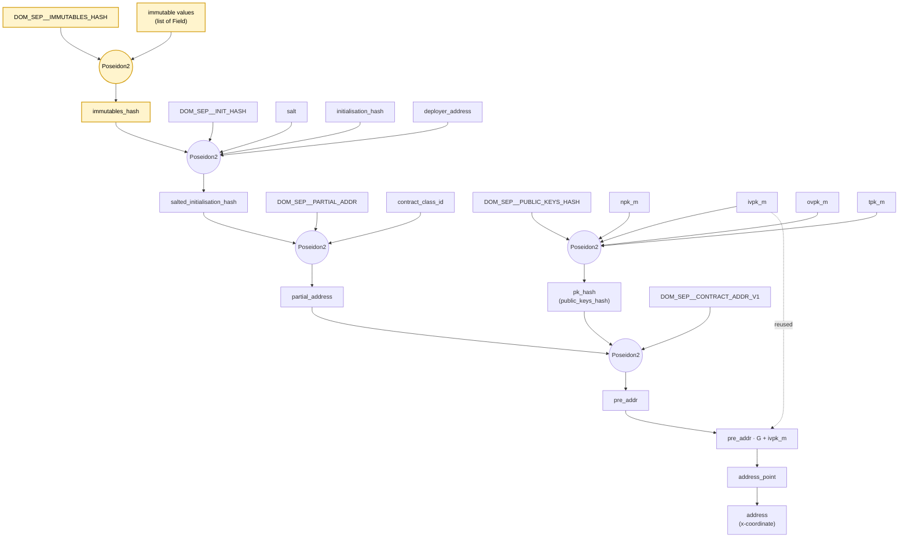

# AZIP-9: Private Immutables

## Preamble


| `azip` | `title` | `description` | `author` | `discussions-to` | `status` | `category` | `created` |
| --- | --- | --- | --- | --- | --- | --- | --- |
|9| Private Immutables | Adds private immutables   | Ilyas Ridhuan (@IlyasRidhuan), Mike Connor (iAmMichaelConnor)  | -  | Draft | Core  | 2026-04-28 |


## Abstract

This AZIP enables deploy-time private immutables as a first-class primitive of the protocol. These immutables are committed to via an `immutables_hash` as part of the contract address.


## Impacted Stakeholders

This AZIP changes contract address derivation, so every stakeholder that consumes, displays, or persists an Aztec address is affected on the next version of Aztec that adopts it. See [Backwards Compatibility](#backwards-compatibility) for the underlying change.

### End Users
A user's contracts (e.g. account contracts, deployed app contracts) will resolve to different addresses on the version of Aztec that adopts this AZIP than on prior versions. Users wishing to interact with both old and new versions will need to track both addresses for the same logical contract.

### App Developers
Contract authors can use the `#[immutable]` attribute (parallel to `#[storage]`) to bind a struct of deploy-time-immutable values to the contract address with protocol-level enforcement.


### Wallets / PXE Implementers
The PXE's contract-registration API has an `immutables` parameter. The PXE verifies the supplied preimage against `instance.immutables_hash` and stores it in a reserved capsule slot keyed by `(contractAddress, IMMUTABLES_CAPSULE_SLOT, contractAddress)`.

Wallets and PXE implementations that intend to operate across rollup versions MUST use versions of `aztec.js` / `aztec-nr` / PXE / node software capable of computing both the pre- and post-AZIP-9 address-derivation schemes.

### Infrastructure Providers (Indexers, P2P Nodes, Block Explorers)
Off-chain decoders of the `ContractInstancePublished` event must be updated to handle the new payload shape (one additional `Field`). `SerializableContractInstance.VERSION` is bumped.

Tooling that indexes or displays addresses across rollup versions MUST be able to compute both the pre- and post-AZIP-9 address-derivation schemes.

## Motivation

Adding a private immutable value to an Aztec contract today involves writing an initialiser function that writes a note to private storage.

There are contract designs which wouldn't otherwise require an initialiser function to be called, or which might not even need a transaction to instantiate the contract. Where applicable, avoiding such notes, function calls, and transactions would reduce deployment complexity, reduce proving times, and reduce dollar-costs.

Alternatively, third-party libraries exist that "hack" immutable values into contracts by overloading existing fields (e.g. salt) in the instance (see Wonderland's [Initializer-less Contracts: The Immutables Macro](https://forum.aztec.network/t/initializerless-contracts-the-immutables-macro/8512) demonstrating this pattern).

## Specification


### Change to the Contract Instance and Event payload
The `ContractInstance` struct SHALL have an additional `Field` member:

```noir
pub struct ContractInstance {
    salt: Field,
    deployer: AztecAddress,
    class_id: ContractClassId,
    initialization_hash: Field,
    public_keys: PublicKeys,
    immutables_hash: Field,
}
```

### Change to Address Derivation
The `immutables_hash` MUST be included as part of the `salted_initialization_hash` when computing the pre-address of an Aztec address.

```noir
salted_initialization_hash = Poseidon2::hash([DOM_SEP__SALTED_INITIALIZATION_HASH, salt, initialization_hash, deployer, immutables_hash])
```
For contracts with no immutable values, `immutables_hash` is `0`, matching the default-zero convention already used for `salt`, `initialization_hash`, and `deployer`.

The protocol cannot enforce this convention — the deployer chooses the `immutables_hash` they commit to in `salted_initialization_hash` — but a deployer who deviates from it produces an address that off-the-shelf tooling will not derive, so users will not interact with the contract at that address (see [Security Considerations](#security-considerations)).

This does require an additional Poseidon2 permutation round. The diagram below shows the address-derivation pipeline as modified by this AZIP. Inputs and intermediate values introduced by AZIP-9 are highlighted; everything else is the existing pipeline, unchanged.



### Change to the Oracle Interface
The oracle interface between the PXE and a private function, which feeds a `ContractInstance` into a private execution, forms part of the protocol since alternative smart-contract frameworks must be able to execute one another's contracts. The oracle response that returns a `ContractInstance` MUST be updated to include the new `immutables_hash` field. Any framework consuming this oracle output MUST handle the additional field when reconstructing or hashing the instance.

### Change to AVM Opcodes
The AVM opcode that loads a `ContractInstance` (e.g. `GETCONTRACTINSTANCE`) MUST return the new payload shape including `immutables_hash`. The AVM's serialization layout for `ContractInstance` is bumped accordingly.

### Change to Kernel Circuits
Kernel circuits that validate the contract address of the function call being processed MUST use the updated `salted_initialization_hash` (which now includes `immutables_hash`) when re-deriving and checking that address. This applies to any kernel-level address-derivation or address-membership check tied to a `ContractInstance`.

## Rationale

By committing to the hash as part of the contract address, the protocol is flexible in that it does not enforce any "shape" to the preimage of the `immutables_hash`, nor any limit to the set of immutable values. The `immutables_hash` is not validated on deployment, instead it is validated on-use and only by functions that require access to the set of immutables.

### Suggested Immutables Hashing Scheme
A new domain separator `DOM_SEP__IMMUTABLES_HASH` could be defined as:

```noir
DOM_SEP__IMMUTABLES_HASH: u32 = poseidon2_hash_bytes(b"az_dom_sep__immutables_hash");
```

The `immutables_hash` itself is defined as the flat hash of the list of immutable values in the contract.
```noir
immutables_hash = Poseidon2::hash([DOM_SEP__IMMUTABLES_HASH, <list_of_field_elements>]);
```

### Suggested Contract API and Verification Flow
The protocol does not mandate a specific smart-contract syntax for declaring or accessing immutables; the choice belongs to smart-contract framework maintainers. The following is offered as a suggestion that aztec-nr could adopt.

A new `#[immutable]` attribute could be provided for contract authors who need to declare a struct as immutable, following the approach taken by `#[storage]`.

```noir
#[immutable]
struct Immutables {
    some_immutable_val: AztecAddress,
    another_immutable_val: u8,
}
```

The `#[external]`, `#[internal]`, and `#[private]` function macros could inspect the function body and inject initialisation code only for functions that reference `self.immutables`.

The injected runtime verification would be:

1) Read `this_address` from the context.
2) Constrained retrieval of the `ContractInstance` using `this_address`.
3) Load the list of immutable values from the capsule store, using the defined reserved slot `IMMUTABLES_CAPSULE_SLOT`.
4) Compute the `immutables_hash` of the capsule-returned values and compare it to the value stored within the `ContractInstance`.
5) Deserialise and return the `Immutables` value to the function.

The estimated cost for this verification is ~2k gates.

A separate AZIP (perhaps from smart-contract framework maintainers) could standardise a preimage layout for the `immutables_hash` (e.g. Merkle tree-style hashing for larger immutable sets that charge per access via a merkle sibling path).

### Eager Verification
Unlike `#[storage]`, where work is only done per-access to `.read()` / `.write()` calls, the immutables are eagerly verified when `self.immutables` is referenced. Subsequent accesses via `self.immutables.<field>` are free, and so the cost of verification is amortised over multiple reads.


### Why no Public Immutables
Public immutables are excluded from this proposal for now. Their inclusion would require discussions around:
1) Setting limits on the number of immutable values available to public functions.
2) Efficient broadcasting of these values to sequencers.
3) Additional opcodes to allow public functions to access these immutable values.

## Backwards Compatibility:

This AZIP is NOT backwards compatible and represents a breaking change to the protocol. The AZIP MUST therefore be shipped as part of a new Aztec rollup.

1) **Address invalidation**. Every existing contract address is derived from a four-input `salted_initialization_hash`. The additional input of `immutables_hash` will produce a different hash.
2) **`ContractInstance` and `ContractInstancePublished` event consumers** MUST parse the new payload that contains the additional field.

## Security Considerations
As `immutables_hash` is not validated on deployment, a deployer could grief a user by deploying with a different `immutables_hash` than the one yielded by the user-specified immutable values. However, a user is able to pre-compute the address that the instance should be deployed at, and so will never interact with the contract with an invalid `immutables_hash`.


## Copyright Waiver:
Copyright and related rights waived via [CC0](https://github.com/AztecProtocol/governance/blob/main/LICENSE).

